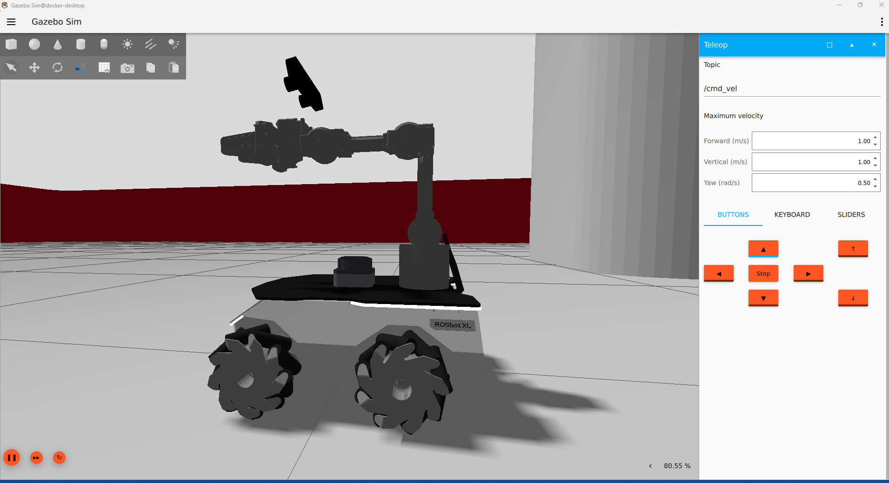
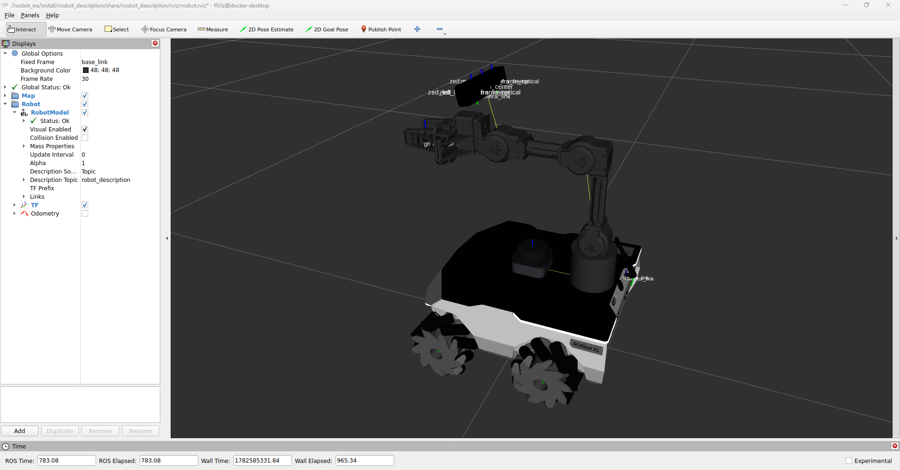

# Rosbot

Webgraphy:
- https://husarion.com/
- https://husarion.com/tutorials/
- https://github.com/husarion/rosbot_ros/tree/jazzy

## 1. Connection setup

The ROSbot by default has:
- user: husarion
- pass: husarion
- Hostname: husarion
- IP address: 192.168.77.2

- First connection with ethernet cable via SSH protocol:
```bash
ssh husarion@192.168.77.2
or
ssh husarion@husarion.local
```
- Change the `netplan` configuration file to add your wifi:
```bash
sudo nano /etc/netplan/01-network-manager-all.yaml
```
> add your SSID and password in official configuration file
- We have assigned the wifi address: 192.168.1.5


## 2. First test

Manual ROSbot driving with teleop_twist_keyboard.
```bash
ros2 run teleop_twist_keyboard teleop_twist_keyboard --ros-args -p stamped:=true
```

The web-based user interface is ready to use out-of-the-box. Simply open the following URL in your web browser:
```bash
http://192.168.1.5:8080/ui
```

## 3. Repository

To work with ROSbot, you can use:
- Local PC Ubuntu24
- Local PC Ubuntu22 with Docker configuration

### 3.1 Local PC Ubuntu24

### 3.1 Local PC Ubuntu22 with Docker configuration

A proper `manelpuig/ros2-jazzy-ub-rosbot:latest` Docker image is created you can work inside the Docker image:
- 

From the official repository you can test first in simulation:
- Launch the `basic` configuration
````bash
ros2 launch rosbot_gazebo simulation.yaml \
  robot_model:=rosbot_xl \
  use_sim:=True \
  configuration:=basic \
  arm_activate:=False \
  rviz:=True
````
- The `configuration` parameter can be:
````bash
basic
telepresence
autonomy
manipulation
manipulation_pro
custom
````
- Launch the `manipulation pro`:
````bash
ros2 launch rosbot_gazebo simulation.yaml \
  robot_model:=rosbot_xl \
  use_sim:=True \
  configuration:=manipulation_pro \
  arm_activate:=True \
  rviz:=True
````




you clone your `my_rUBot_rosbot` in /root/

you create 2 new packages:
- my_rosbot_bringup
- my_rosbot_control

To simulate:
```bash
ros2 launch rosbot_gazebo simulation.launch.py
```

For our custom:
```bash
ros2 launch my_rosbot_bringup bringup_custom_sw.launch.py
ros2 run my_rosbot_control teleop_simple 
```